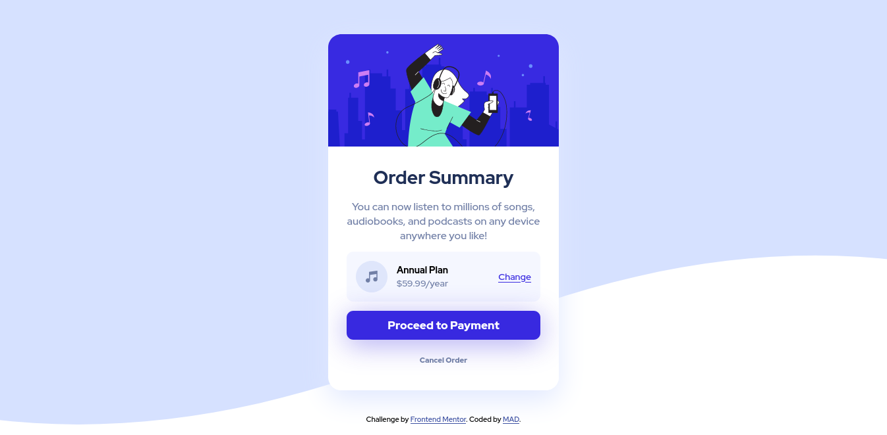

# Frontend Mentor - Order summary card solution

This is a solution to the [Order summary card challenge on Frontend Mentor](https://www.frontendmentor.io/challenges/order-summary-component-QlPmajDUj). Frontend Mentor challenges help you improve your coding skills by building realistic projects.

## Table of contents

- [Overview](#overview)
  - [The challenge](#the-challenge)
  - [Screenshot](#screenshot)
- [My process](#my-process)
  - [Built with](#built-with)
  - [What I learned](#what-i-learned)
  - [Continued development](#continued-development)
- [Author](#author)

## Overview

### The challenge

Users should be able to:

- See hover states for interactive elements

### Screenshot

<!-- ### Links

- Solution URL: [Add solution URL here](https://your-solution-url.com)
- Live Site URL: [Add live site URL here](https://your-live-site-url.com) -->

## My process

### Built with

- Semantic HTML5 markup
- CSS custom properties
- Flexbox

### What I learned

UI design fundamentals including but not limited to negative spacing, uniformity and contrast.

To see how you can add code snippets, see below:

### Continued development

It is very important to know the fundamentals of UI design to become a good Frontend Developer. I would like to use these principles in my future projects.

## Author

- Website - [!MAD!](http://imadi-arch.github.io/)
- Frontend Mentor - [@iMADi-ARCH](https://www.frontendmentor.io/profile/iMADi-ARCH)
- Twitter - [@iMADi69235681](https://twitter.com/iMADi69235681)
- LinkedIn - [Aditya Nandan](https://www.linkedin.com/in/aditya-nandan-thats-it/)
